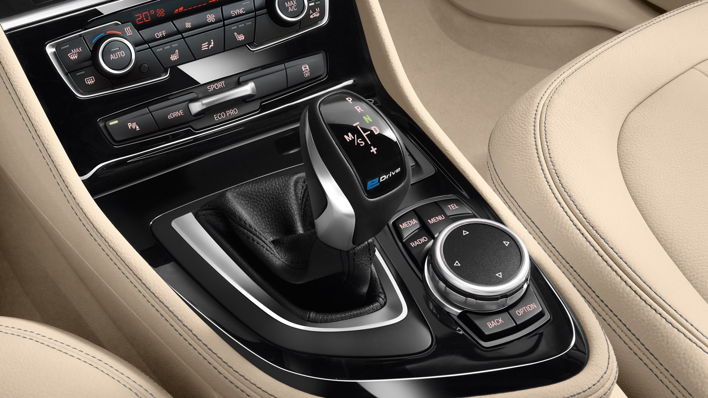
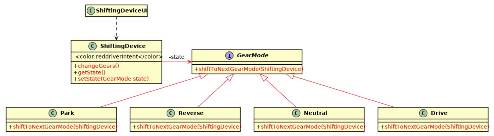

# Observer and State Patterns

The goal of this exercise is to use the state pattern and the observer pattern.

Our scenario is an automatic transmission in a car. The automatic transmission has gear modes:

- P for park
- R for reverse
- N for neutral
- D for drive

If you change to a gear mode, the letter for the gear mode on the shift lever (=Schalthebel) changes its color. 

You can only change from one gear mode to one of its neighboring gear modes in a traditional automatic car. E.g. if you want to change from P to D, then you first need to shift P->R, then R->N, and then N->D. If you want to 
parallel park your car and switch back and forth between forward and reverse driving, then you need to do R->N->D  or D->N->R every time you want to 
change directions. 

This image shows a traditional automatic car (if you can't see the image, open the README.md in the repository):

In this exercise we want to build a simulation for a shifting device (called SD) to make changing gear modes easier for a driver. 

Our shifting device SD has three buttons: **forward**, **backward**, and **park**. This shifting device SD operates with a 
traditional automatic car and does the necessary gear mode shifting for the user. E.g. let's assume the shifting device SD is set 
to **park** and the automatic transmission is in P. When the user then presses **forward** on SD, the automatic transmission shifting 
sequence P->R->N->D is done for the user. SD always figures out the correct shifting sequence depending on the current state of 
 the automatic transmission.

SD also makes sure that the letter colors change correctly on the shift lever. This means, that the shift lever displays P->R->N->D when SD is doing a 
shift from **park** to **forward**.

The current gear mode is the state of the automatic transmission. You should use the _state pattern_ to model the gear modes. Displaying the current gear mode on the shift lever is a perfect application for the _observer pattern_.

**You have the following tasks:**

### State Pattern

Apply the state pattern to the automatic transmission. The gear modes are the states. 
The shifting device (SD) is the context in the state pattern. The classes used in the state pattern
are shown in the UML diagram below. The suggested class names for *state* is GearMode and for *context* is ShiftingDevice. 
All state classes (the abstract state and the concrete states) are in the `states` package.

@startuml

class ShiftingDeviceUI {
  
}

class ShiftingDevice {
  -<color:testsColor(testAttributes[ShiftingDevice])driverIntent</color>
  +<color:testsColor(testMethods[ShiftingDevice])>changeGears()</color>
  +<color:testsColor(testMethods[ShiftingDevice])>getState()</color>
  +<color:testsColor(testMethods[ShiftingDevice])>setState(GearMode state)</color>
}

interface GearMode {
  +<color:testsColor(testMethods[GearMode])>shiftToNextGearMode(ShiftingDevice)</color>
}

class Park {
  +<color:testsColor(testMethods[Park])>shiftToNextGearMode(ShiftingDevice)</color>
}
class Reverse {
  +<color:testsColor(testMethods[Reverse])>shiftToNextGearMode(ShiftingDevice)</color>
}
class Neutral {
  +<color:testsColor(testMethods[Neutral])>shiftToNextGearMode(ShiftingDevice)</color>
}
class Drive {
  +<color:testsColor(testMethods[Drive])>shiftToNextGearMode(ShiftingDevice)</color>
}

Park -up-|> GearMode #testsColor(testFields[Park])
Reverse -up-|> GearMode #testsColor(testFields[Reverse])
Neutral -up-|> GearMode #testsColor(testFields[Neutral])
Drive -up-|> GearMode #testsColor(testFields[Drive])

ShiftingDevice -right-> GearMode #testsColor(testFields[ShiftingDevice]): -state
ShiftingDeviceUI .down.> ShiftingDevice

@enduml

### Observer Pattern

Apply the observer pattern to simulate the correct display of the current gear mode of the automatic transmission.
This exercise is doing things the simple way. Instead of a real display, we just print the current gear modes
using `System.out.print()`.

Implement the observer pattern as described in the lecture. The Observer class and the Subject class go in the `observer` package:

1. ✅[Implement the observer interface](testMethods[Observer]) 

2. ✅[Implement the abstract subject](testAttributes[Subject])

3. ✅[Implement the concrete observer](testMethods[ShiftingDeviceUI]) 

The class `ShiftingDeviceUI` is the concrete observer.
The class `ShiftingDevice`is the concrete subject.

### make sure it works

The shifting device works correctly if 

1. ✅[Changing to forward direction works](testForward)

2. ✅[Changing to backward direction works](testBackward)

3. ✅[Changing to parking works](testPark)
# Patterns
